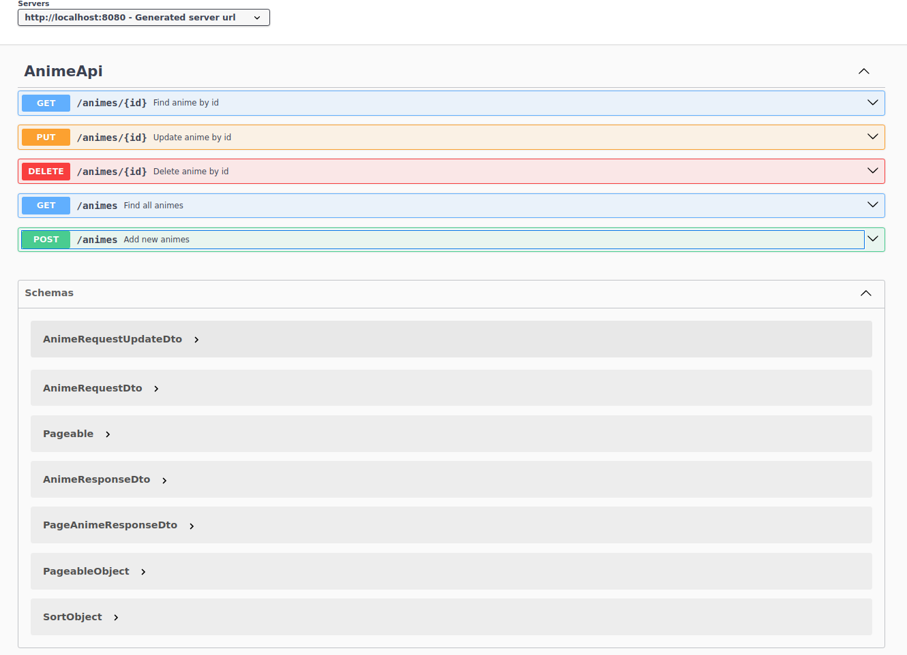

# AnimeAPI


[](https://github.com/Joseulisses065/AnimeApi/releases )

# Resume

An anime API project that lists different animes with data such as category description title and where to watch

## 🔨 Project features

The Api makes it possible to query by id as well as retrieve the complete list of animes, making it possible to insert and update as well as delete animes.


## ✔️ Techniques and technologies used

The techniques and technologies used for this are:

- `Java 17`: Latest long-term support (LTS) version of the Java platform
- `Spring Boot 3`: A framework that facilitates the creation of Spring-based Java applications, offering automatic configuration and sober configuration opinions.
- `PostgreSQL`: An object-relational database management system, developed as an open source project.
- `Docker`: A set of platform-as-a-service products that use operating system-level virtualization to deliver software in packages called containers.


## 🎯 Challenge

Product details screen




## 📁 Access to the project

You can [access the source code of the initial project](https://github.com/Joseulisses065/AnimeApi)

## 🛠️ Open and run the project
### Clone this repository
```
git clone
```
